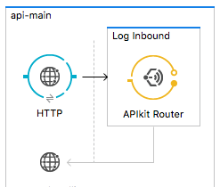
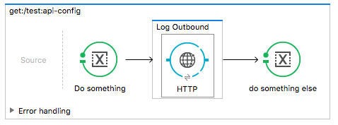
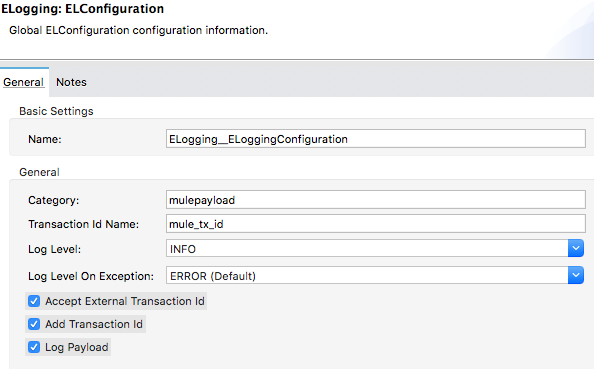

# Mule Enterprise Logging

## The problem

Root cause analysis is one of the most important tasks in any mule project, but can be quite difficult and time consuming 
to do, especially in API project because for various reasons which include:
- HTTP logging can be used but misses critical information like what URL is being called, forcing developers to constantly go refer to the code
- HTTP logging happens in a different thread, so a log correlation id cannot be used
- APIKit wipes out the payload before the exception handling code receives it, making it impossible to log the reason for the error if you're using APIKit exception handling

## The solution

This framework is designed to solve all those issues (and more) by providing the following capabilities:

1) logging payload and all metadata for all inbound/outbound operations (even when an exception occurs)
4) Adds a correlation id to all logs, that is propagated across API and systems
5) Record timings for inbound and outbound operations, allowing to quickly and easily identify time spend waiting for backend systems and time mule spent processing

# Connectors

## Installation

### Anypoint Studio

In order to use the elogging connectors, you will need to add the kloudtek mule update site to studio 
(http://updatesites.kloudtek.com/mule/), and install the ELogging Connector.

In order to do that, click on the help menu, and select 'Install New Software'


Then in the screen click on the "Add" button next to the update site selection dropdown


And fill in the details for the kloudtek mule update site, and press the "Ok" button


After that install the ELogging Connector (under the 'Community' category)


### Maven

To add the elogging connector to your project (that will be done automatically by studio if you used the above method, 
although keep in mind studio will not automatically update the pom with new versions) just add:

```xml
<dependency>
    <groupId>com.kloudtek.mule.elogging</groupId>
    <artifactId>mule-elogging-connector</artifactId>
    <version>0.9.17</version>
</dependency>
```

## Inbound/Outbound logging

ELogging provides you two connector scopes, one for logging an inbound transaction/call and one for outbound transaction/calls


The inbound connector should be used to used to wrap all logic in inbound flows. For example:



The outbound connector should be used to wrap any connector that directly connects to external systems. Only wrap the 
connector that performs the operation, otherwise connector analysis (that extracts extra information and include it in the logs)
will not work.

Example:



Either of those connector will result in all message data to be logged as a JSON message. ie:

```
INFO  2018-02-12 17:15:54,301 [[elogging-example].api-httpListenerConfig.worker.03] mulepayload: {"type":"inbound","message":"inbound mule message","mule.request.content":"{NullPayload}","mule.request.encoding":"UTF-8","mule.request.mimeType":"*/*","mule.request.payloadClass":"org.mule.transport.NullPayload","mule.request.inboundProperties.http.request.uri":"/test","mule.request.inboundProperties.http.query.string":"","mule.request.inboundProperties.http.query.params":"ParameterMap{[]}","mule.request.inboundProperties.http.listener.path":"/*","mule.request.inboundProperties.http.remote.address":"/0:0:0:0:0:0:0:1:50666","mule.request.inboundProperties.http.uri.params":"ParameterMap{[]}","mule.request.inboundProperties.mule_tx_id":"619c55b7-d092-4fd1-b71a-4ff101afc0bb","mule.request.inboundProperties.accept":"*/*","mule.request.inboundProperties.host":"localhost:8081","mule.request.inboundProperties.http.version":"HTTP/1.1","mule.request.inboundProperties.http.method":"GET","mule.request.inboundProperties.http.relative.path":"/test","mule.request.inboundProperties.http.request.path":"/test","mule.request.inboundProperties.http.scheme":"http","mule.request.inboundProperties.user-agent":"curl/7.54.0","mule.request.outboundProperties.mule_tx_id":"619c55b7-d092-4fd1-b71a-4ff101afc0bb","mule.response.content":"{\n   \"results\" : [\n      {\n         \"address_components\" : [\n            {\n               \"long_name\" : \"Oxford\",\n               \"short_name\" : \"Oxford\",\n               \"types\" : [ \"postal_town\" ]\n            },\n            {\n               \"long_name\" : \"Oxfordshire\",\n               \"short_name\" : \"Oxfordshire\",\n               \"types\" : [ \"administrative_area_level_2\", \"political\" ]\n            },\n            {\n               \"long_name\" : \"England\",\n               \"short_name\" : \"England\",\n               \"types\" : [ \"administrative_area_level_1\", \"political\" ]\n            },\n            {\n               \"long_name\" : \"United Kingdom\",\n               \"short_name\" : \"GB\",\n               \"types\" : [ \"country\", \"political\" ]\n            },\n            {\n               \"long_name\" : \"OX1 2JD\",\n               \"short_name\" : \"OX1 2JD\",\n               \"types\" : [ \"postal_code\" ]\n            }\n         ],\n         \"formatted_address\" : \"Oxford OX1 2JD, UK\",\n         \"geometry\" : {\n            \"location\" : {\n               \"lat\" : 51.7548164,\n               \"lng\" : -1.2543668\n            },\n            \"location_type\" : \"GEOMETRIC_CENTER\",\n            \"viewport\" : {\n               \"northeast\" : {\n                  \"lat\" : 51.75616538029149,\n                  \"lng\" : -1.253017819708498\n               },\n               \"southwest\" : {\n                  \"lat\" : 51.75346741970849,\n                  \"lng\" : -1.255715780291502\n               }\n            }\n         },\n         \"place_id\" : \"ChIJW0iM76nGdkgR7a8BoIMY_9I\",\n         \"types\" : [ \"establishment\", \"point_of_interest\", \"university\" ]\n      }\n   ],\n   \"status\" : \"OK\"\n}\n","mule.response.encoding":"UTF-8","mule.response.mimeType":"application/json","mule.response.payloadClass":"org.glassfish.grizzly.utils.BufferInputStream","mule.response.inboundProperties.date":"Tue, 13 Feb 2018 01:15:54 GMT","mule.response.inboundProperties.server":"mafe","mule.response.inboundProperties.expires":"Wed, 14 Feb 2018 01:15:54 GMT","mule.response.inboundProperties.transfer-encoding":"chunked","mule.response.inboundProperties.vary":"Accept-Language,Accept-Encoding","mule.response.inboundProperties.x-frame-options":"SAMEORIGIN","mule.response.inboundProperties.http.reason":"OK","mule.response.inboundProperties.access-control-allow-origin":"*","mule.response.inboundProperties.x-xss-protection":"1; mode=block","mule.response.inboundProperties.http.status":"200","mule.response.inboundProperties.content-type":"application/json; charset=UTF-8","mule.response.inboundProperties.alt-svc":"hq=\":443\"; ma=2592000; quic=51303431; quic=51303339; quic=51303338; quic=51303337; quic=51303335,quic=\":443\"; ma=2592000; v=\"41,39,38,37,35\"","mule.response.inboundProperties.cache-control":"public, max-age=86400","mule.response.inboundProperties.accept-ranges":"none","mule.response.outboundProperties.http.status":"200","mule.response.outboundProperties.Content-Type":"application/json;charset=UTF-8","mule.response.flowVars._ApikitResponseTransformer_contractMimeTypes":"[application/json]","mule.response.flowVars._ApikitResponseTransformer_AcceptedHeaders":"*/*","mule.response.flowVars._ApikitResponseTransformer_bestMatchRepresentation":"application/json","mule.response.flowVars._ApikitResponseTransformer_apikitRouterRequest":"yes","messageSourceUri":"http://localhost:8081/test","messageSourceName":"http://localhost:8081/test","duration":2158,"flowName":"api-main","flowFileName":"api.xml","flowFileLine":"11"}
```

## Configuration

The connector supports the following configuration



- **Category**: Log category for logs generated by the connectors
- **Transaction id name**: Name of the log correlation id
- **Log Level**: Log level for logs generated by the connectors
- **Log Level on Exception**: Log level for logs generated by the connectors when an exception occurs
- **Accept external transaction id**: If checked it will use the value received in inbound property using the name specified in *Transaction id name*
- **Add transaction id**: If checked this will add a log correlation id as an inbound and outbound property using the name specified in *Transaction id name*
- **Log Payload**: If checked it will log the payload content

## JSON Layout

If you're going to send your log messages to a centralized log system like Splunk or ELK, it is highly advisable to use a json layout for your logs.

Although in theory this a simple thing to do, mule dependency conflicts makes that extremely hard which required the creation
of a custom JSON layout that is compatible with mule.

To use our JSON logger in an application, you need to edit the log4j configuration file (`src/main/resources/log4j2.xml`) 
and specify the layout as `ELJsonLayout`, as well as adding `com.kloudtek.mule.elogging.log4j2` to the configuration `packages` attributes to the 
configuration.

example:

```xml
<?xml version="1.0" encoding="utf-8"?>
<Configuration packages="com.kloudtek.mule.elogging.log4j2">
    <Appenders>
        <RollingFile name="jsonFile" fileName="${sys:mule.home}${sys:file.separator}logs${sys:file.separator}elogging-example.log.json"
                 filePattern="${sys:mule.home}${sys:file.separator}logs${sys:file.separator}elogging-example-%i.log.json">
            <ELJsonLayout/>
            <SizeBasedTriggeringPolicy size="10 MB"/>
            <DefaultRolloverStrategy max="10"/>
        </RollingFile>
        <RollingFile name="file" fileName="${sys:mule.home}${sys:file.separator}logs${sys:file.separator}elogging-example.log" 
                 filePattern="${sys:mule.home}${sys:file.separator}logs${sys:file.separator}elogging-example-%i.log">
            <PatternLayout pattern="%d [%t] %-5p %c - %m%n" />
            <SizeBasedTriggeringPolicy size="10 MB" />
            <DefaultRolloverStrategy max="10"/>
        </RollingFile>
    </Appenders>
    <Loggers>
		<AsyncLogger name="org.mule.module.http.internal.HttpMessageLogger" level="WARN"/>
		<AsyncLogger name="com.mulesoft.mule.transport.jdbc" level="WARN"/>
        <AsyncLogger name="org.apache.cxf" level="WARN"/>
        <AsyncLogger name="org.apache" level="WARN"/>
        <AsyncLogger name="org.springframework.beans.factory" level="WARN"/>
        <AsyncLogger name="org.mule" level="INFO"/>
        <AsyncLogger name="com.mulesoft" level="INFO"/>
        <AsyncLogger name="org.jetel" level="WARN"/>
        <AsyncLogger name="Tracking" level="WARN"/>
        <AsyncRoot level="INFO">
            <AppenderRef ref="file" />
            <AppenderRef ref="jsonFile" />
        </AsyncRoot>
    </Loggers>
</Configuration>
```

With this layout, your log will look like this:

```json
{
  "loggerName": "mulepayload",
  "loggerFqcn": "org.apache.logging.log4j.spi.AbstractLogger",
  "threadName": "[logtest-1.0.0-SNAPSHOT].api-httpListenerConfig.worker.01",
  "level": "INFO",
  "type": "inbound",
  "message": "inbound mule message",
  "mule.request.content": "{NullPayload}",
  "mule.request.encoding": "UTF-8",
  "mule.request.mimeType": "*/*",
  "mule.request.payloadClass": "org.mule.transport.NullPayload",
  "mule.request.inboundProperties.http.request.uri": "/api/ping",
  "mule.request.inboundProperties.http.query.string": "",
  "mule.request.inboundProperties.http.query.params": "ParameterMap{[]}",
  "mule.request.inboundProperties.http.listener.path": "/api/*",
  "mule.request.inboundProperties.http.remote.address": "/127.0.0.1:51328",
  "mule.request.inboundProperties.http.uri.params": "ParameterMap{[]}",
  "mule.request.inboundProperties.mule_tx_id": "6affe84e-dcff-4eaa-8018-e40a0c8d312a",
  "mule.request.inboundProperties.accept": "*/*",
  "mule.request.inboundProperties.host": "localhost:8081",
  "mule.request.inboundProperties.http.version": "HTTP/1.1",
  "mule.request.inboundProperties.http.method": "GET",
  "mule.request.inboundProperties.http.relative.path": "/api/ping",
  "mule.request.inboundProperties.http.request.path": "/api/ping",
  "mule.request.inboundProperties.http.scheme": "http",
  "mule.request.inboundProperties.user-agent": "curl/7.54.0",
  "mule.request.outboundProperties.mule_tx_id": "6affe84e-dcff-4eaa-8018-e40a0c8d312a",
  "mule.response.content": "{\"status\":\"200\",\"message\":\"Alive\",\"apiVersion\":\"v1\",\"appVersion\":\"1.0.0\",\"build\":\"example\"}",
  "mule.response.encoding": "UTF-8",
  "mule.response.mimeType": "application/json",
  "mule.response.payloadClass": "java.lang.String",
  "mule.response.inboundProperties.http.request.uri": "/api/ping",
  "mule.response.inboundProperties.http.query.string": "",
  "mule.response.inboundProperties.http.query.params": "ParameterMap{[]}",
  "mule.response.inboundProperties.http.listener.path": "/api/*",
  "mule.response.inboundProperties.http.remote.address": "/127.0.0.1:51328",
  "mule.response.inboundProperties.http.uri.params": "ParameterMap{[]}",
  "mule.response.inboundProperties.mule_tx_id": "6affe84e-dcff-4eaa-8018-e40a0c8d312a",
  "mule.response.inboundProperties.accept": "*/*",
  "mule.response.inboundProperties.host": "localhost:8081",
  "mule.response.inboundProperties.http.version": "HTTP/1.1",
  "mule.response.inboundProperties.http.method": "GET",
  "mule.response.inboundProperties.http.relative.path": "/api/ping",
  "mule.response.inboundProperties.http.request.path": "/api/ping",
  "mule.response.inboundProperties.http.scheme": "http",
  "mule.response.inboundProperties.user-agent": "curl/7.54.0",
  "mule.response.outboundProperties.http.status": "200",
  "mule.response.outboundProperties.Content-Type": "application/json",
  "mule.response.outboundProperties.mule_tx_id": "6affe84e-dcff-4eaa-8018-e40a0c8d312a",
  "mule.response.flowVars._ApikitResponseTransformer_contractMimeTypes": "[application/json]",
  "mule.response.flowVars._ApikitResponseTransformer_AcceptedHeaders": "*/*",
  "mule.response.flowVars._ApikitResponseTransformer_bestMatchRepresentation": "application/json",
  "mule.response.flowVars._ApikitResponseTransformer_apikitRouterRequest": "yes",
  "messageSourceUri": "http://localhost:8081/api/ping",
  "messageSourceName": "http://localhost:8081/api/ping",
  "duration": 72,
  "flowName": "api-main",
  "flowFileName": "api.xml",
  "flowFileLine": "10",
  "tcMap": {
    "mule_tx_id": "6affe84e-dcff-4eaa-8018-e40a0c8d312a"
  },
  "timestamp": "2018-02-08T18:39:49.978Z"
}
```

In order to add it to the mule runtime itself, you will need to download the mule-elogging-log4j2.jar file (https://mvnrepository.com/artifact/com.kloudtek.mule.elogging/mule-elogging-log4j2),
and add it to `lib/boot` directory of the mule runtime.

You can also use this command to download the jar: `mvn dependency:get -Dartifact=com.kloudtek.mule.elogging:mule-elogging-log4j2:0.9.17 -Ddest=mule-elogging-log4j2-0.9.17.jar`  

You will then be able to add the layout to the `conf/log4j2.xml` file (you don't need to specify the packages attribute when the jar is added to the server, although we recommend *always* doing so for the applications)

example:

```xml
<Configuration>
    <Appenders>
        <Console name="Console" target="SYSTEM_OUT">
            <PatternLayout pattern="%-5p %d [%t] %c: %m%n"/>
        </Console>
        <RollingFile name="file" fileName="${sys:mule.home}${sys:file.separator}logs${sys:file.separator}mule_ee.log.json"
        		filePattern="${sys:mule.home}${sys:file.separator}logs${sys:file.separator}mule_ee-%i.log.json">
            <ELJsonLayout/>
            <SizeBasedTriggeringPolicy size="10 MB" />
            <DefaultRolloverStrategy max="2"/>
        </RollingFile>
    </Appenders>
    <Loggers>
        <AsyncLogger name="org.apache.cxf" level="WARN"/>
        <AsyncLogger name="org.apache" level="WARN"/>
        <AsyncLogger name="org.springframework.beans.factory" level="WARN"/>
        <AsyncLogger name="org.mule" level="INFO"/>
        <AsyncLogger name="com.mulesoft" level="INFO"/>
        <AsyncLogger name="org.jetel" level="WARN"/>
        <AsyncLogger name="Tracking" level="WARN"/>
        <AsyncLogger name="com.mulesoft.analytics" level="INFO" />
        <AsyncLogger name="com.mulesoft.module.client" level="INFO"/>
        <AsyncLogger name="com.mulesoft.module.policies" level="INFO"/>
        <AsyncRoot level="INFO">
            <AppenderRef ref="Console"/>
            <AppenderRef ref="file"/>
        </AsyncRoot>
    </Loggers>
</Configuration>
```

# Example application

See https://github.com/Kloudtek/mule-elogging/tree/master/example for an example mule application

# Outbound controller analysers

As mentioned earlier, the outbound connection has the ability to analyse the wrapper connector to obtain extra information.
Those are added to the logs under the "connector." namespace (ie.: connection.path, connection.method in the case of http)

Currently the supported controllers are:

- HTTP

You can also create your own custom analysers by extending the class `com.kloudtek.mule.elogging.util.ConnectorAnalyser`,
and registering it as a java service as describe here: https://docs.oracle.com/javase/tutorial/ext/basics/spi.html#definte-the-service-that-retrieves-service-provider-implementations

# Reporting Issues

You can report new issues at this link http://github.com/Kloudtek/mule-elogging/issues.

# Licensing

Mule ELogging is licensed under the GPL 3
